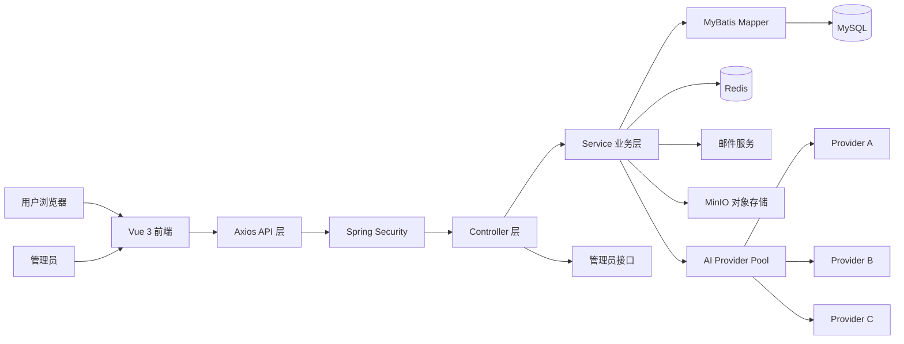
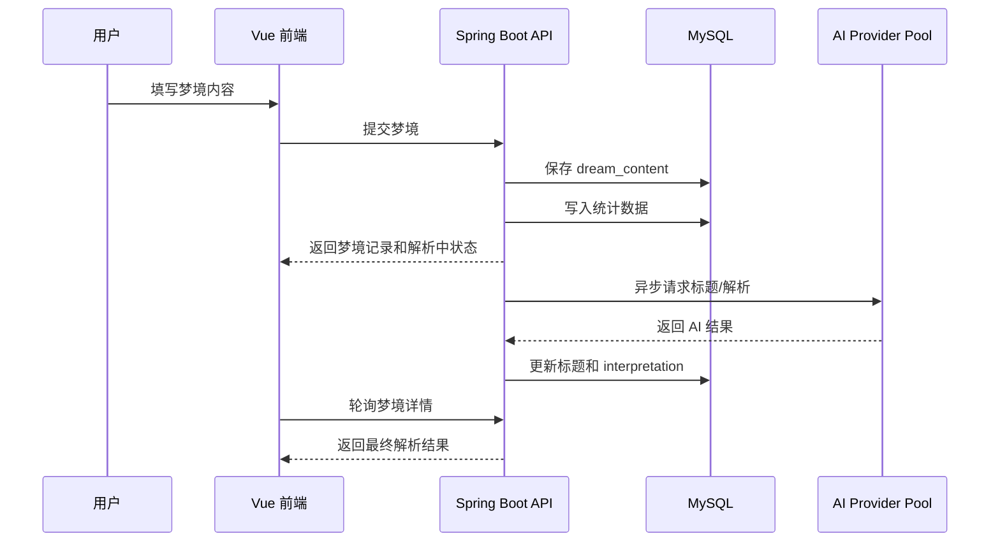
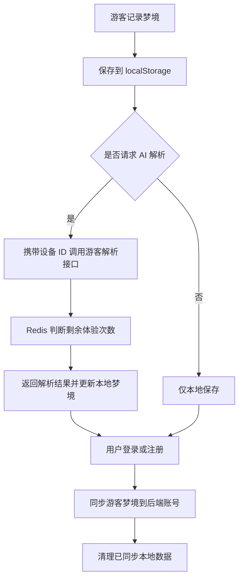

# DreamArchive

DreamArchive 是一个面向个人梦境记录、AI 解读与长期情绪洞察的全栈 Web 应用。项目以“梦境档案”为核心概念，支持用户记录梦境文本、情绪、地点、时间和图片，并通过 AI 自动生成梦境标题与解读内容，最终形成可检索、可统计、可持续沉淀的个人梦境资料库。

项目不仅实现了基础的账号、梦境 CRUD 和统计功能，还进一步加入了游客体验、AI 多 provider 池化、异步解析、图片上传、多模态分析、管理员后台、权限控制和统计预计算等能力，整体更接近一个完整的产品级应用。

> 说明：本项目中的 AI 梦境解析用于辅助记录与自我观察，不用于医学诊断或心理治疗结论。

## 核心功能

| 模块 | 功能说明 |
|------|----------|
| 用户系统 | 注册、密码登录、验证码登录、自动注册、修改密码、重置密码、账号资料维护 |
| 认证授权 | HMAC-SHA256 Token、Spring Security 过滤链、角色权限、管理员访问控制 |
| 梦境记录 | 梦境新增、列表查询、详情查看、搜索、删除、自动标题、AI 解析 |
| 游客模式 | 未登录用户可体验记录与 AI 解析，登录或注册后自动同步游客梦境 |
| AI 解析 | 接入 OpenAI 兼容格式模型，支持文本梦境解析和图片辅助分析 |
| AI 资源池 | 多 provider 加权轮询、延迟感知、熔断降级、管理员运行时管理 |
| 图片能力 | 图片上传、格式与文件头校验、MinIO 存储、预签名 URL 访问 |
| 统计图表 | 梦境总数、情绪分布、地点分布、趋势图、连续记录天数 |
| 管理后台 | 用户管理、封禁/解封、软删除、最近梦境查看、AI provider 管理 |
| 前端体验 | 梦幻玻璃拟态主界面、Dashboard 风格后台、移动端向导式记录流程 

## 技术栈

| 层级 | 技术选型 |
|------|----------|
| 前端框架 | Vue 3、TypeScript、Vite |
| 前端路由与状态 | Vue Router、Pinia |
| 网络请求 | Axios、请求拦截器、统一错误处理 |
| UI 与交互 | CSS3、响应式布局、Glassmorphism、移动端向导式表单 |
| 后端框架 | Java 17、Spring Boot 3.5.7、Spring MVC |
| 安全框架 | Spring Security、BCrypt、HMAC-SHA256 Token |
| 数据访问 | MyBatis、XML Mapper |
| 数据库 | MySQL |
| 缓存与限流 | Redis |
| 邮件服务 | Spring Mail、SMTP 验证码 |
| 文件存储 | MinIO |
| AI 调用 | Java HttpClient、OpenAI Compatible Chat Completions API |
| API 文档 | SpringDoc OpenAPI / Swagger UI |
| 构建工具 | Maven、npm、Vite |

## 系统架构



整体采用前后端分离架构。前端负责页面交互、路由守卫、会话管理和本地游客数据；后端负责认证授权、业务规则、数据持久化、AI 调度、统计计算和资源管理。业务代码按 Controller、Service、Mapper、DTO、Config、Util 分层，便于维护和扩展。

## 后端架构亮点

后端基于 Spring Boot 3.5.7 和 Java 17 构建，整体采用经典分层结构：

| 层级 | 职责 |
|------|------|
| Controller | 对外暴露 REST API，处理请求参数、权限上下文和返回结果 |
| Service | 承载核心业务逻辑，如登录注册、梦境保存、AI 解析、统计更新 |
| Mapper | 通过 MyBatis XML 访问 MySQL，保持 SQL 可读性和可控性 |
| DTO | 定义用户、梦境、统计、管理员视图、AI provider 等数据模型 |
| Config | Spring Security、CORS、Token 过滤器、异步任务、全局异常处理 |
| Util | 统一返回结构、密码加密、验证码生成等工具能力 |

### 认证与权限

项目没有依赖传统 Session，而是使用无状态 Token 认证：

- 登录成功后生成 HMAC-SHA256 签名 Token。
- 前端将 Token 存入本地，并通过 Axios 拦截器自动附带到请求头。
- 后端 `TokenAuthenticationFilter` 解析 Token 后，会再次查询数据库确认用户未被删除或封禁。
- 管理员接口统一限制为 `ROLE_ADMIN`。
- 前端路由也配置了 `requiresAuth`、`guestOnly`、`requiresAdmin` 等守卫。

这种设计兼顾了前后端分离场景下的易用性和权限安全。

### 验证码与频率控制

注册、登录、修改密码、重置密码均接入邮箱验证码。验证码保存在 Redis 中，并设置有效期和发送频率限制：

- 验证码 5 分钟有效。
- 同一场景下 60 秒内限制重复发送。
- 校验通过后立即删除验证码。
- 邮件发送失败时返回用户友好提示，避免暴露 SMTP 细节。

### 梦境保存与异步 AI 解析

梦境保存采用“先落库、后解析”的方式：

1. 用户提交梦境内容。
2. 后端先保存到 `dream_content` 表，保证数据不丢失。
3. 如果需要 AI 解析，立即写入“解析中”状态。
4. 异步任务生成标题和解析结果。
5. 前端通过轮询刷新解析状态。

这种方案避免了 AI 接口耗时导致用户提交卡住，也让系统在 AI 调用失败时仍能保留用户原始梦境。

## 前端架构亮点

前端基于 Vue 3、TypeScript 和 Vite 构建，采用组件化页面结构：

| 模块 | 说明 |
|------|------|
| `views` | 首页、登录、注册、记录梦境、梦境列表、统计、个人资料、管理员后台等页面 |
| `api` | 按业务拆分用户、梦境、管理员 API，并复用统一 Axios 实例 |
| `stores` | 使用 Pinia 管理登录状态、用户信息、角色和会话过期 |
| `router` | 路由懒加载、登录态守卫、管理员权限守卫 |
| `utils` | 游客梦境、本地同步、错误处理、解析文本格式化等工具函数 |

前端设计上区分了两套视觉体系：

- 主功能页面采用梦幻玻璃拟态风格，适合梦境记录、AI 解析和个人统计这类偏情绪化、沉浸式的场景。
- 管理后台采用简洁 Dashboard 风格，突出信息密度、表格管理和操作效率。

RecordDreamView 针对桌面端和移动端采用不同交互结构：桌面端为左右分栏，移动端为两步向导式表单，让同一功能在不同设备上都有较好的使用体验。

## 数据模型设计

| 表 | 作用 | 设计特点 |
|----|------|----------|
| `user` | 用户账号表 | 支持角色、状态、软删除、创建时间 |
| `dream_content` | 梦境主表 | 使用 UUID 主键，保存标题、内容、情绪、地点、时间、图片、AI 解析 |
| `dream_stats` | 每日统计表 | 按用户和日期预计算梦境总数与情绪计数 |
| `dream_place_stats` | 地点统计表 | 按用户和地点预计算梦境数量 |

统计系统没有每次都直接扫描梦境主表，而是在新增梦境时同步更新统计表，在删除梦境后重建对应统计。这种方式适合后续数据量增大后的图表查询优化。

## AI 资源池设计

AI 资源池是项目中最有技术含量的模块之一。它将多个 AI provider 抽象为统一资源池，并对调用过程做动态调度。

### 调度策略

项目使用类似 Nginx 的平滑加权轮询算法，并叠加延迟感知因子：

```text
有效权重 = 基础权重 × 1000 / (1000 + 平均延迟 ms)
```

当某个 provider 延迟较低时，它会获得更高的有效权重；当延迟上升时，流量会自然向其他 provider 倾斜。

### 延迟感知

每次 AI 请求完成后，系统会记录耗时，并使用指数移动平均更新 provider 的平均延迟。这样可以避免单次抖动造成剧烈变化，同时又能让最近的性能状态逐步影响调度结果。

### 熔断降级

当某个 provider 连续失败达到阈值后，会进入熔断状态：

```text
正常 -> 连续失败 -> 熔断 -> 半开试探 -> 成功恢复 / 失败继续熔断
```

这可以避免单个 AI 服务异常拖垮整体体验。即使某个模型接口临时不可用，系统仍可切换到其他 provider。

### 运行时管理

管理员可以通过后台接口查看 provider 状态，并动态新增、删除、启用、禁用、调整权重或重置熔断状态。这让 AI 接入不再是静态配置，而是可运营、可观测、可调整的系统能力。

## 项目创新点

### 1. AI 多 provider 池化，而不是单接口调用

普通 AI 应用通常只配置一个模型接口，一旦接口超时、限流或故障，用户体验会直接受影响。本项目通过 AI provider 池实现了多模型、多供应商的统一调度，并加入权重、延迟和失败状态，具备更强的稳定性和可扩展性。

### 2. 延迟感知调度，让系统自动偏向更快的模型

项目不是简单随机选择 provider，而是根据请求延迟动态调整有效权重。低延迟 provider 会自然承担更多请求，高延迟 provider 会自动降权，形成轻量级的自适应调度能力。

### 3. 熔断降级机制，提高 AI 服务容错能力

连续失败的 provider 会自动熔断，避免系统持续把请求打到异常服务上。熔断到期后再进入半开试探，成功后恢复，失败则继续熔断。这是后端工程中比较典型的高可用设计思想。

### 4. 异步 AI 解析，兼顾数据可靠性和用户体验

用户提交梦境后先保存数据，再由后台异步解析。前端显示解析中状态并轮询更新结果。这种设计解决了 AI 响应慢、接口失败、网络抖动等问题，让记录动作本身始终稳定可用。

### 5. 游客模式降低使用门槛，并支持登录后数据同步

未登录用户也可以记录梦境并体验有限次数的 AI 解析。游客数据保存在 localStorage 中，后端通过 Redis 和设备 ID 限制体验次数。用户登录或注册后，本地游客梦境会自动同步到账号下，减少注册前后的数据断层。

### 6. 文本 + 图片的多模态梦境表达

项目支持上传梦境相关图片，并在 AI 分析时将图片预签名 URL 与文本描述一起传入模型。对于梦境这种强画面感内容，多模态输入比纯文本更贴近真实表达。

### 7. 文件安全校验不只看扩展名

图片上传同时校验 contentType 和文件头魔数，降低伪造文件类型的风险。上传后使用 MinIO 保存，并通过预签名 URL 访问，避免直接暴露存储资源。

### 8. 统计预计算提升图表查询性能

情绪分布、地点分布和趋势图不是完全依赖实时扫描主表，而是通过统计表维护结果。新增梦境时增量更新，删除梦境时重建相关统计，兼顾性能和数据准确性。

### 9. 前后台双视觉体系

主功能页面强调梦幻感和沉浸式记录体验；管理员后台强调清晰、稳定和操作效率。项目没有用一套样式硬套所有页面，而是根据用户场景区分视觉语言。

### 10. 完整的账号安全闭环

项目覆盖了注册验证码、登录验证码、密码登录、修改密码、重置密码、账号封禁、软删除、Token 过期、管理员权限等完整流程，安全链路相对完整。

## 核心业务流程

### 梦境记录与 AI 解析



### 游客模式同步



## 安全设计

- 密码使用 BCrypt 加密存储。
- Token 使用 HMAC-SHA256 签名，并设置有效期。
- 后端每次鉴权都会查询数据库确认用户状态。
- 管理员接口通过 `ROLE_ADMIN` / `ROLE_SUPER_ADMIN` 控制。
- 验证码使用 Redis TTL，校验后立即删除。
- 验证码发送有频率限制，防止滥用。
- 游客 AI 解析有设备级次数限制。
- 图片上传限制大小、类型和文件头。
- CSP 响应头限制脚本来源（`script-src 'self'`），防止 XSS。
- X-Frame-Options、X-Content-Type-Options、Referrer-Policy 安全头。
- 错误响应隐藏异常详情，友好提示给用户，详细信息写服务端日志。
- CORS 白名单集中配置，部署时需加服务器公网 IP。
- 敏感配置不应提交到 Git，应通过环境变量或本地配置注入。

## 工程亮点

| 方向 | 亮点 |
|------|------|
| 可维护性 | 前后端分层清晰，业务模块拆分明确 |
| 稳定性 | AI provider 熔断、异步解析、失败降级 |
| 性能 | 统计预计算、前端路由懒加载、请求拦截复用 |
| 安全性 | Token 认证、角色权限、Redis 验证码、上传校验 |
| 用户体验 | 游客体验、登录后同步、移动端向导、解析轮询 |
| 可扩展性 | AI provider 可动态扩展，统计维度可继续增加 |

## 项目目录概览

```text
src/main/java/com/yiweilai/DreamArchive/
├── controller/    # REST API 控制器
├── service/       # 业务逻辑、AI 池、统计、认证、文件服务
├── mapper/        # MyBatis Mapper 接口
├── DTO/           # 数据传输对象和业务模型
├── config/        # 安全、CORS、Token、异步、全局异常配置
└── util/          # 通用返回、密码工具等

src/main/resources/
├── mapper/        # MyBatis XML SQL
└── db/            # 数据库建表与补丁脚本

fount/
├── src/views/     # Vue 页面组件
├── src/api/       # 前端 API 封装
├── src/router/    # 路由与权限守卫
├── src/stores/    # Pinia 状态管理
└── src/utils/     # 游客数据、错误处理、解析格式化等工具
```

## 接口清单

### 公开接口（无需认证）

| 方法 | 路径 | 功能 |
|------|------|------|
| POST | `/api/login` | 密码登录 |
| POST | `/api/login/send-code` | 登录验证码 |
| POST | `/api/login/code` | 验证码登录（不存在则自动注册） |
| POST | `/api/register` | 注册（需验证码） |
| POST | `/api/register/send-code` | 注册验证码 |
| POST | `/api/reset-password/send-code` | 重置密码验证码 |
| POST | `/api/reset-password` | 重置密码 |
| POST | `/api/guest/analyze` | 游客 AI 解析（设备级限流） |
| GET | `/api/hello` | 健康检查 |

### 需认证接口

| 方法 | 路径 | 功能 |
|------|------|------|
| POST | `/api/account/setup` | 新用户设置用户名密码 |
| POST | `/api/change-password/send-code` | 修改密码验证码 |
| POST | `/api/change-password` | 修改密码（需验证码） |
| GET | `/api/dream/{id}` | 查单个梦境 |
| GET | `/api/dreams/user/{userId}` | 查用户所有梦境 |
| POST | `/api/analysisDream` | 保存梦境 |
| POST | `/api/dreams/save-and-analyze` | 保存 + 异步 AI 解析 |
| POST | `/api/dream/{id}/delete` | 删除梦境 |
| POST | `/api/dream/{id}/analyze` | 重新 AI 解析 |
| POST | `/api/upload/image` | 上传图片到 MinIO |
| GET | `/api/stats/{userId}` | 统计数据 |
| GET | `/api/stats/{userId}/emotion` | 情绪分布 |
| GET | `/api/stats/{userId}/place` | 地点分布 |
| GET | `/api/stats/{userId}/trend` | 趋势数据 |
| GET | `/api/stats/{userId}/streak` | 连续记录天数 |
| GET | `/api/user/by-email` | 邮箱查用户 |
| GET | `/api/user/by-username` | 用户名查用户 |
| POST | `/api/user/avatar` | 更新头像 |

### 管理员接口（需 ROLE_ADMIN 或 ROLE_SUPER_ADMIN）

| 方法 | 路径 | 功能 |
|------|------|------|
| POST | `/api/admin/overview` | 管理总览 |
| POST | `/api/admin/user-action` | 用户操作 |
| POST | `/api/admin/delete-user` | 软删除 |
| POST | `/api/admin/dream-detail` | 梦境详情 |
| GET | `/api/admin/ai-pool/providers` | 查看所有 AI provider 状态 |
| POST | `/api/admin/ai-pool/providers` | 添加 provider |
| POST | `/api/admin/ai-pool/providers/{name}/update` | 更新 provider |
| POST | `/api/admin/ai-pool/providers/{name}/delete` | 删除 provider |
| POST | `/api/admin/ai-pool/providers/{name}/reset` | 重置熔断 |

## 本地运行

后端需要 Java 17、MySQL、Redis、MinIO 以及邮件和 AI provider 配置。敏感信息建议放在本地配置文件或环境变量中，不提交到仓库。

```bash
# 后端编译
mvn -DskipTests compile

# 后端启动
mvn spring-boot:run
```

```bash
# 前端安装依赖
cd fount
npm install

# 前端开发环境
npm run dev

# 前端生产构建
npm run build
```

## 环境要求

| 组件 | 版本要求 | 说明 |
|------|---------|------|
| JDK | 17+ | Spring Boot 3.5.7 最低要求 Java 17 |
| Maven | 3.8+ | 后端构建工具 |
| Node.js | 18+ | 前端构建工具 |
| npm | 9+ | 前端包管理 |
| MySQL | 8.0+ | 主数据库 |
| Redis | 6.0+ | 验证码 & 缓存 |
| MinIO | 最新稳定版 | 对象存储（图片/头像） |
| Nginx | 1.20+ | 反向代理 & 前端静态资源 |

## 配置说明

项目提供 `application.properties.example` 作为配置模板。首次使用时复制并填入实际值：

```bash
cp src/main/resources/application.properties.example src/main/resources/application.properties
```

需要配置的服务：

| 服务 | 配置项 | 说明 |
|------|--------|------|
| MySQL | `spring.datasource.*` | 数据库连接地址、用户名、密码 |
| Redis | `spring.data.redis.*` | 缓存与验证码存储，可选密码认证 |
| MinIO | `minio.*` | 对象存储，用于图片和头像上传 |
| 邮件 | `spring.mail.*` | QQ 邮箱 SMTP，用于发送验证码 |
| AI | `ai.pool.providers[*].*` | AI 模型接口，支持多 provider 配置 |
| CORS | `app.cors.*` | 跨域白名单，部署时必须加服务器公网 IP |
| 认证 | `app.auth.secret` | Token 签名密钥（>= 32 字符），生产环境务必修改 |

## 服务器部署

### 数据库

```bash
# 安装 MySQL 8.0 后，创建数据库并导入
mysql -u root -p -e "CREATE DATABASE dream DEFAULT CHARACTER SET utf8mb4 COLLATE utf8mb4_0900_ai_ci;"
mysql -u root -p dream < dream.sql
```

完整建表 SQL 包含 `user`、`dream_content`、`dream_stats`、`dream_place_stats` 四张表。首次注册的用户自动成为超级管理员（`SUPER_ADMIN`）。

### Redis

```bash
# CentOS
yum install -y redis
systemctl start redis && systemctl enable redis
```

配置 `/etc/redis.conf`：设置 `bind 0.0.0.0`（允许远程连接）、`requirepass`（密码认证）、`appendonly yes`（持久化）。

### MinIO

```bash
# 下载并启动
wget https://dl.min.io/server/minio/release/linux-amd64/minio
chmod +x minio && mv minio /usr/local/bin/
minio server /data/minio --address ":9000" --console-address ":9001"
```

启动后访问 `http://服务器IP:9001`，创建 Bucket `dream-archive` 并设置公开读取策略。

### 后端

```bash
# 构建
mvn clean package -DskipTests

# 运行（生产环境）
java -jar target/DreamArchive-0.0.1-SNAPSHOT.jar --spring.profiles.active=prod
```

推荐使用 Systemd 管理后端服务，配置自动重启和日志轮转。

### 前端

```bash
cd fount
npm install
npm run build    # 产物输出到 fount/dist/
```

将 `dist/` 目录部署到 Nginx 静态资源目录。

### Nginx 反向代理

```nginx
server {
    listen 80;
    server_name your-domain.com;

    root /var/www/dream-archive;
    index index.html;

    # Vue Router history 模式
    location / {
        try_files $uri $uri/ /index.html;
    }

    # API 反向代理
    location /api/ {
        proxy_pass http://127.0.0.1:8080/api/;
        proxy_set_header Host $host;
        proxy_set_header X-Real-IP $remote_addr;
        proxy_set_header X-Forwarded-For $proxy_add_x_forwarded_for;
        client_max_body_size 10m;
        proxy_read_timeout 120s;    # AI 解析可能较慢
    }

    # 静态资源缓存
    location ~* \.(js|css|png|jpg|jpeg|gif|ico|svg|woff2?)$ {
        expires 7d;
        add_header Cache-Control "public, immutable";
    }

    gzip on;
    gzip_types text/plain text/css application/json application/javascript text/xml;
}
```

### HTTPS（可选）

```bash
# 使用 Let's Encrypt 免费证书
yum install -y certbot python3-certbot-nginx
certbot --nginx -d your-domain.com
echo "0 2 * * 1 certbot renew --quiet" | crontab -
```

### CORS 白名单

部署新服务器时，需将服务器 IP 加入 CORS 白名单，否则前端请求会返回 403。在 `application.properties` 中修改 `app.cors.allowed-origin-patterns`，加入服务器公网 IP。

### 部署检查清单

- [ ] `http://服务器IP` 能访问前端页面
- [ ] `http://服务器IP/api/hello` 返回健康检查响应
- [ ] 注册新用户，收到验证码邮件
- [ ] 登录后能正常记录梦境
- [ ] AI 解析功能正常返回
- [ ] 图片上传功能正常
- [ ] 管理员后台 `/admin` 可正常访问
- [ ] 深色模式切换正常
- [ ] 手机端访问布局正常

> 完整部署文档（含常见问题排查、JVM 调优、数据库备份等）见 [docs/DEPLOYMENT.md](docs/DEPLOYMENT.md)。

## 项目关键词

- Spring Boot 3
- Vue 3
- TypeScript
- MyBatis
- MySQL
- Redis
- Spring Security
- BCrypt
- MinIO
- AI Application
- OpenAI Compatible API
- Circuit Breaker
- Weighted Round Robin
- Glassmorphism UI
- Full Stack Project

## 后续可扩展方向

1. 将 AI provider 的运行时配置持久化到数据库，避免重启后丢失。
2. 为 AI 调用增加更完整的监控面板，如成功率、平均延迟、熔断次数和模型成本。
3. 增加梦境标签、收藏、导出、时间轴和日历视图。
4. 增加更细粒度的统计分析，如情绪变化趋势、常见符号、关键词云。
5. 引入单元测试和接口测试，提高登录、权限、AI 池和统计逻辑的回归保障。
6. 支持 Docker Compose 一键启动 MySQL、Redis、MinIO 和后端服务。
7. Token 存储从 localStorage 迁移到 HttpOnly Cookie（`feat/httponly-cookie` 分支）。

## 开源协议

本项目使用 MIT License 开源。

你可以自由地使用、复制、修改、合并、发布、分发、再授权或销售本项目的副本，但需要在副本或重要部分中保留原始版权声明和许可声明。

详细内容见 [LICENSE](LICENSE)。
